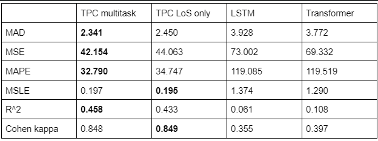

# cs598DLH-tpc-LoS

To load TPC-LoS, TPC-multitask, LSTM, and Transformer model, navigate to bdeleon2 and start a local runtime notebook. You can connect to our ipynb on colab with the notebook (https://research.google.com/colaboratory/local-runtimes.html) and run the models. Must be on Python 3.6 and meet the `requirements.txt`. Make sure the paths.json is set correctly to where your pre-processed data is. Currently only trained on MIMIC. Pre-processing instructions can be found in bdeleon2 in their respective folders.

If running the limited tests, insert the test files into the test directory inside whichever path you set up the MIMIC data on.

# Length of Stay Prediction using Temporal Pointwise Convolution (TPC)

This repository contains the code and resources for predicting the Length of Stay (LoS) in Intensive Care Units (ICUs) using the Temporal Pointwise Convolution (TPC) model, as well as other baseline models such as LSTM and Transformer.

## Table of Contents

- [cs598DLH-tpc-LoS](#cs598dlh-tpc-los)
- [Length of Stay Prediction using Temporal Pointwise Convolution (TPC)](#length-of-stay-prediction-using-temporal-pointwise-convolution-tpc)
  - [Table of Contents](#table-of-contents)
  - [Setup](#setup)
    - [Prerequisites](#prerequisites)
    - [Installation](#installation)
  - [Data Preprocessing](#data-preprocessing)
    - [MIMIC-IV Dataset](#mimic-iv-dataset)
    - [eICU Dataset](#eicu-dataset)
  - [Model Training and Evaluation](#model-training-and-evaluation)
  - [Results](#results)
    - [Table of results](#table-of-results)
    - [TPC Model Ablations:](#tpc-model-ablations)
      - [**Kappa Score (train_kappa)**](#kappa-score-train_kappa)
      - [**Mean Absolute Error (train_mad)**](#mean-absolute-error-train_mad)
      - [**Mean Absolute Percentage Error (train_mape)**](#mean-absolute-percentage-error-train_mape)
      - [**MSE and MSLE (train_mse \& train_msle)**](#mse-and-msle-train_mse--train_msle)
      - [**Coefficient of Determination (R², train_r2)**](#coefficient-of-determination-r-train_r2)
      - [**Validation Metrics**](#validation-metrics)
      - [**Overall Interpretation**](#overall-interpretation)
- [Discussion](#discussion)
  - [Implications of the Experimental Results](#implications-of-the-experimental-results)
  - [Reproducibility of the Original Paper](#reproducibility-of-the-original-paper)
    - [**What Was Easy**](#what-was-easy)
    - [**What Was Difficult**](#what-was-difficult)
    - [Recommendations for Improving Reproducibility](#recommendations-for-improving-reproducibility)
    - [Transformer Model Ablations](#transformer-model-ablations)
      - [Kappa Score (train_kappa)](#kappa-score-train_kappa-1)
      - [Mean Absolute Error (train_mad)](#mean-absolute-error-train_mad-1)
      - [Mean Absolute Percentage Error (train_mape)](#mean-absolute-percentage-error-train_mape-1)
      - [MSE and MSLE (train_mse \& train_msle)](#mse-and-msle-train_mse--train_msle-1)
      - [Coefficient of Determination (R², train_r2)](#coefficient-of-determination-r-train_r2-1)
      - [Validation Metrics](#validation-metrics-1)
      - [Overall Interpretation](#overall-interpretation-1)
  - [License](#license)

## Setup

### Prerequisites

- Python 3.6
- PostgreSQL
- Windows machine (for the provided setup guide)

### Installation

1. Clone the repository:

   ```
   git clone https://github.com/yourusername/cs598DLH-tpc-LoS.git
   cd cs598DLH-tpc-LoS
   ```

2. Install the required Python packages:

   ```
   pip install -r requirements.txt
   ```

3. Set up the PostgreSQL database by following the Length of Stay Prediction Task Setup Guide.

4. Update the `Tpc-LoS-Prediction/paths.json` file with the correct paths to your preprocessed data.

## Data Preprocessing

### MIMIC-IV Dataset

1. Navigate to the MIMIC-IV preprocessing directory:

   ```
   cd Tpc-Los-Prediction/MIMIC-IV_preprocessing
   ```

2. Follow the preprocessing instructions provided in the directory's README.

### eICU Dataset

1. Navigate to the eICU preprocessing directory:

   ```
   cd Tpc-LoS-Prediction/eICU_preprocessing
   ```

2. Follow the preprocessing instructions provided in the directory's README.

## Model Training and Evaluation

1. Open the `DL4H_Team_82.ipynb` notebook in Google Colab.

2. Connect the notebook to a local runtime by following the instructions in the Colab Local Runtimes guide.

3. Run the notebook cells in sequence to train and evaluate the TPC-LoS, TPC-multitask, LSTM, and Transformer models.

4. If running the limited tests, insert the test files into the test directory inside the path where you set up the MIMIC data.

5. To **train** the models using the provided training script under `Tpc-LoS-Prediction`, run:

```python
   python models.run_tpc --model_type tpc --dataset MIMIC
```

6. To **evaluate** the trained models, you can use the same `run_tpc.py` script but change the `mode` to <i>'test'</i>, run:

```python
python models.run_tpc --model_type tpc --mode test --dataset MIMIC
```

Alternatively, for both training and evaluation, you can go to the corresponding sections in the `DL4H_Team_82.ipynb` notebook and run the corresponding code cells to get the results.

7. You can use the Pre-trained models check the `Tpc-LoS-Prediction/models/experiments` folder to check the model checkpoint under the checkpoint for different runs.

## Results

### Table of results

**Best scores are bolded**

<!--  -->



These results confirm the hypotheses as the TPC model far outperforms LSTM and transformers. The TPC model trained on the multitask task also performed better or about the same as the model trained on length of stay only. These results agree with the original paper.

### TPC Model Ablations:

#### **Kappa Score (train_kappa)**

**The TPC Model (MSLE)** has a lower kappa score compared to the standard TPC model and TPC No Decay, but is higher than TPC No Labs. This suggests moderate agreement with the true labels, possibly indicating that while the MSLE training focuses on reducing logarithmic discrepancies, it may not be as effective for classification consistency as some other configurations.

#### **Mean Absolute Error (train_mad)**

**TPC MSE** shows significantly higher train MAD than the TPC MSLE model. This suggests that when optimizing directly for MSE, the model may be less effective at minimizing absolute deviations compared to when trained with MSLE, likely due to the focus of MSE on minimizing the squares of the errors which can overlook larger errors more than MSLE.

#### **Mean Absolute Percentage Error (train_mape)**

**TPC MSE** has an extraordinarily high MAPE compared to other models, including the TPC MSLE. High MAPE in MSE suggests that the relative size of the errors compared to actual values is larger, which could indicate poor performance in data with varying scales or with many outliers.

#### **MSE and MSLE (train_mse & train_msle)**

**TPC MSLE** achieves lower training MSE and MSLE compared to TPC MSE and slightly better than TPC No Decay, showing its effectiveness in handling both squared and logarithmic errors.

#### **Coefficient of Determination (R², train_r2)**

The **TPC MSLE** model has an R² closer to the TPC model but lower than the TPC No Labs and Temp Only models, indicating less variability explained by the model compared to these configurations but similar to the standard setup.

#### **Validation Metrics**

When considering validation metrics, it's essential to determine if the training improvements translate to unseen data:

- **Validation MAPE (val_mape)** is much lower in TPC MSLE than in TPC MSE, suggesting better generalization regarding relative error.
- **Validation MSE (val_mse)** is also lower in TPC MSLE than TPC MSE, further confirming the effectiveness of MSLE in general performance across data scales.

#### **Overall Interpretation**

The **TPC MSLE model** generally shows balanced performance across various metrics, indicating it is well-suited for datasets where outliers or scale variations are significant. It shows particular strength in handling logarithmic errors, which benefits modeling of exponential growth or heavy-tailed data without being overly influenced by outliers.

Comparing **TPC MSLE** with **TPC No Decay** suggests that incorporating some form of regularization or decay might help stabilize training further, as seen in slightly better kappa and R² scores in the No Decay setup.

# Discussion

## Implications of the Experimental Results

The experimental results indicate that the Temporal Pointwise Convolutional (TPC) model outperforms LSTM and transformer models for predicting length of stay (LoS) in the ICU, as shown in the original paper. The multitask TPC model, which predicts both LoS and mortality, also performed well, confirming the hypotheses of the original paper.

## Reproducibility of the Original Paper

The original paper appears to be reproducible to a certain extent. The provided code snippets and the structure of the experiment template suggest that the authors followed a systematic approach to model training, validation, and testing, which is conducive to reproducibility.

### **What Was Easy**

- **Data Preprocessing:** The preprocessing steps for both eICU and MIMIC datasets were well-documented, making it easy to prepare the data for model training.
- **Model Initialization:** Initializing the TPC model with the best hyperparameters was straightforward due to the clear documentation and the `initialise_arguments` function provided.
- **Training and Evaluation:** The `ExperimentTemplate` class provided a structured way to train and evaluate the models, which simplified these processes. Running training was relatively easy once everything else was figured out.

### **What Was Difficult**

- **Hyperparameter Tuning:** Finding the best hyperparameters might be challenging without a clear understanding of the search space or the computational resources required. Additionally, downgrading to Python 3.6 along with the libraries was difficult.
- **Interpretability:** Visualizing and interpreting model predictions and importances was complex, as it required a deep understanding of the model's internals and the use of additional tools like Integrated Gradients.
- **Environment Setup:** Ensuring that the correct versions of libraries and dependencies were installed could be a hurdle, as the codebase might not be fully compatible with the latest versions. Loading the model was challenging due to outdated libraries and custom loaders.
- **Model Implementation:** There were bugs in the code and missing sections that the authors claimed to have but did not. Additionally, running the TPC model in a notebook was buggy and slow.

### Recommendations for Improving Reproducibility

- **Documentation:** Provide detailed documentation for each step of the experiment, including data preprocessing, model training, and evaluation. Additionally, fully implement what is claimed in the code.
- **Version Control:** Use a version control system to track changes in the code and include a `requirements.txt` file to specify the exact versions of libraries used.
- **Environment Setup:** Update to newer versions of Python and simplify the pipeline to reduce compatibility issues. Ensure that the codebase is fully implemented and functional.
- **Automated Testing:** Implement automated tests to verify that the code produces the expected outputs at each step.
- **Clear Licensing:** Provide a clear license for the code and data to inform users of how they can use and modify the resources.

By addressing these recommendations, the original authors and others in the field can enhance the reproducibility of their research, facilitating validation and further advancements in the area of ICU stay prediction.

### Transformer Model Ablations

#### Kappa Score (train_kappa)

Transformer models show moderate kappa scores, indicating a fair level of agreement with the true labels across all configurations. The standard Transformer and Transformer No Labs perform slightly better than the Transformer MSE. This suggests that the MSE optimization might slightly degrade the classification consistency compared to the other setups.

#### Mean Absolute Error (train_mad)

**Transformer MSE** has a slightly higher train MAD than the other configurations, implying it might be less effective at minimizing absolute deviations. This could be due to the MSE loss giving more weight to larger errors, which might not always align with reducing absolute deviations.

#### Mean Absolute Percentage Error (train_mape)

The **Transformer MSE** configuration has significantly higher MAPE, indicating a greater average percentage error compared to the standard Transformer and Transformer No Labs. This suggests that optimizing for MSE might lead to poorer performance on data with varied scales or in cases where relative error reduction is crucial.

#### MSE and MSLE (train_mse & train_msle)

The **Transformer MSE** shows lower training MSE but higher MSLE compared to the other models. This indicates that while MSE optimization effectively reduces squared errors, it might not perform as well when the error distribution is skewed or when the emphasis is on the logarithmic scale, as seen with the higher MSLE.

#### Coefficient of Determination (R², train_r2)

The Transformer models generally have low R² scores, with the MSE version having a slightly higher score than the others. This suggests that while the MSE model may capture more variability, the overall explanatory power of all models is quite limited.

#### Validation Metrics

These are crucial for understanding how the model might perform on unseen data:

- **Validation MAPE** (val_mape) and **Validation MSE (val_mse)** are significantly higher for the Transformer MSE, indicating that the improvements seen in training MSE do not generalize as effectively to unseen data.
- **Validation MSLE** (val_msle) shows that the Transformer and **Transformer No Labs** models might generalize better in terms of logarithmic errors.

#### Overall Interpretation

- The **Transformer MSE** is optimized to reduce mean squared errors, which can make the model sensitive to outliers or disproportionately large errors. This might not be ideal for applications like Length of Stay prediction, where the scale of errors can vary significantly.
- **Transformer No Labs** performs comparably to the standard Transformer, suggesting that additional layers or complexity might not necessarily yield better results for this particular task. This could indicate that simpler models might be sufficient, or that the additional layers do not capture more useful patterns from the data.
- The similar performance metrics across the Transformer models in terms of kappa and R² highlight a general limitation in model fit or the challenging nature of the prediction task, possibly suggesting the need for further model tuning or consideration of different modeling approaches.

## License

This project is licensed under the MIT License. See the `LICENSE` file for details.

---

For any questions or issues, please open an issue on the GitHub repository.
